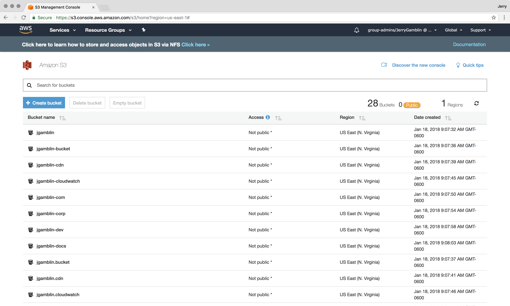
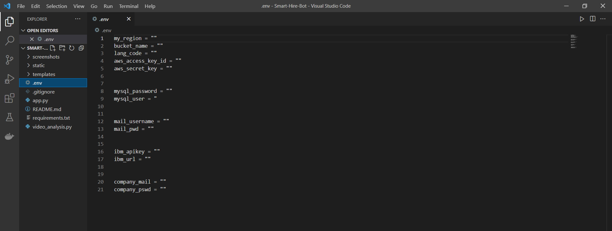
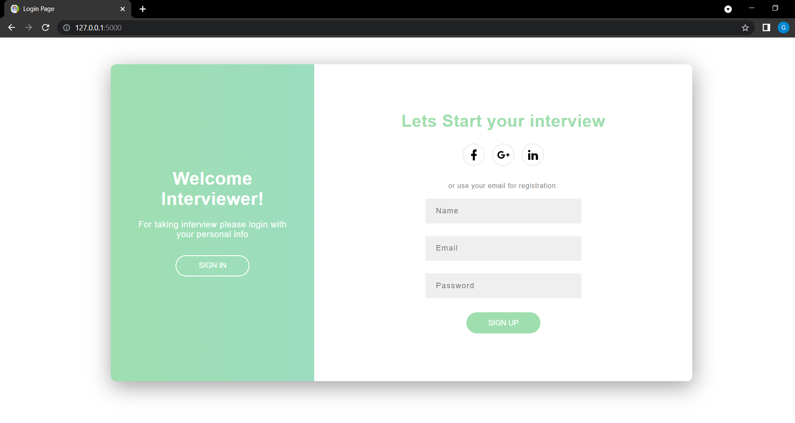
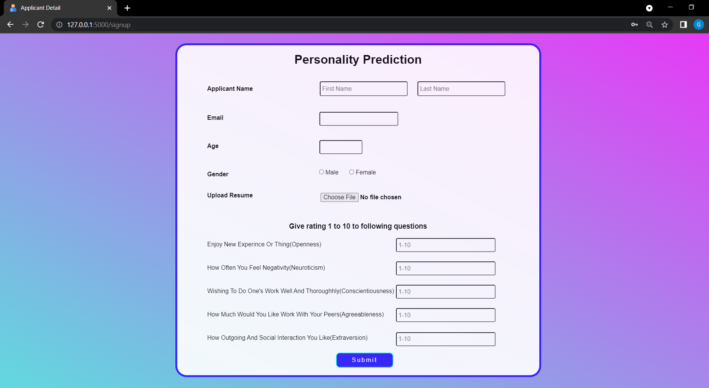
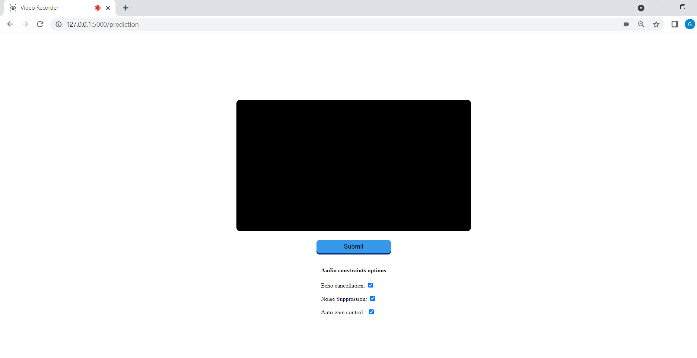
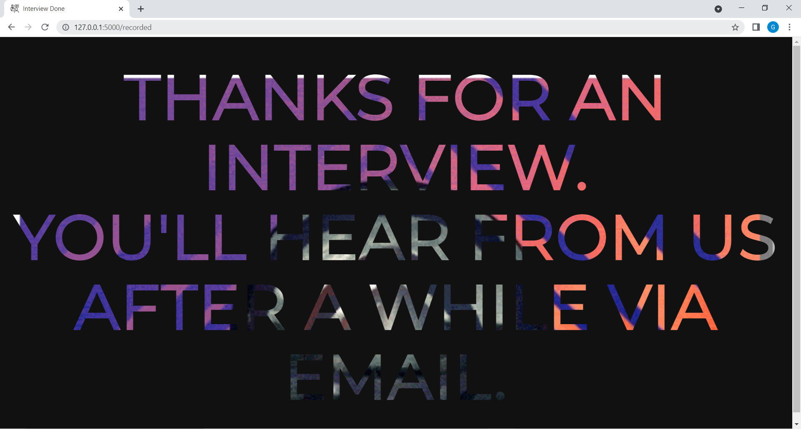
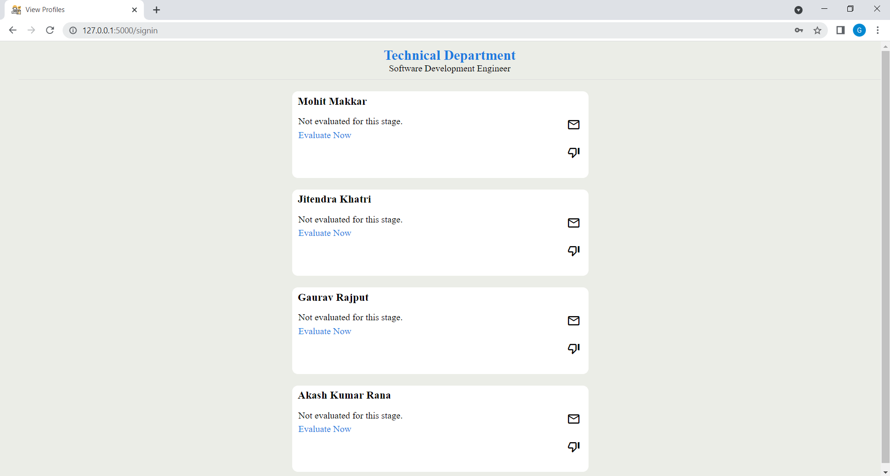
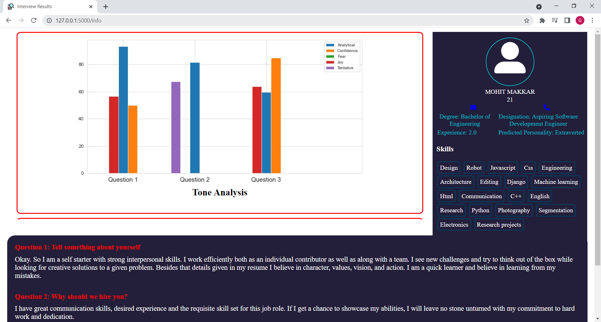
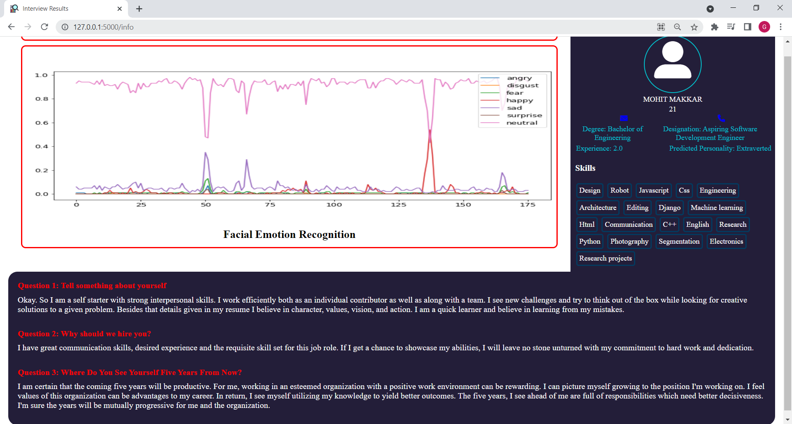
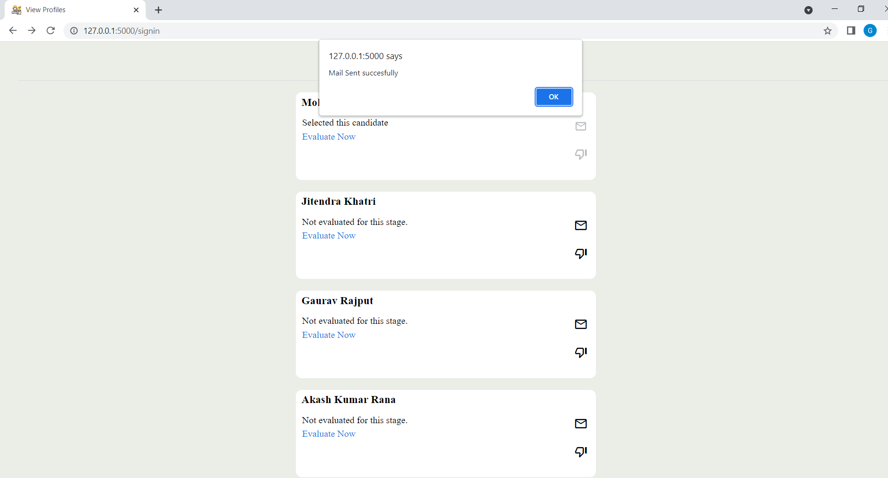

# Introduction

__SMART-HIRE-BOT__ : an application with an aim to automate the interview process.

## Inspiration
In most organisations, recruitment is a complex and time-consuming process, since they get a large number of job applications for openings that are called. Handling those job applications manually would need a significant amount of labour, time, and money. In addition, the HR personnel or the recruitment team must manually shortlist the incoming applicants and schedule interviews for them accordingly. This lengthy procedure makes the company's operations inefficient.

## Objectives

- Application to automate the hiring process
- Personality prediction using Machine Learning, 
- Automatic resume parser
- Handle the scheduling of interviews
- Video recording in browser 
- Check confidence and other traits using video and tone analysis
- Send mail to selected/rejected candidates automatically in one-click
- Fast recruitment in larger numbers
- Generate concise insights and provide summary of the candidate's profile
- Handy application for HR/Recruiting Team

## Project Workflow
- Interviewee
     - Enter personal details, upload resume, attempt a questionnaire wherein the candidate has to rate himself/herself
     - Personality prediction (based on [Big Five Personality Traits](https://www.thomas.co/resources/type/hr-guides/what-are-big-5-personality-traits) model) with OCEAN values and CV analysis
     - Video recording in browser. The candidate has to answer few questions put up by the HR team on the portal.
     - Face emotion and Speech Analysis to get insights like confidence level, candidate personality traits
     
- Interviewer/HR team/Admin
     - View all the registered candidates’ details
     - View each candidate's profile summary which includes resume, responses to questions, technical skills, personality traits, video and tone analysis result.
     - Update candidate about selection/rejection, further interview process using one-click mail or phone call

## Presentation of Slides
[Presentation Link](https://docs.google.com/presentation/d/1L1slU4owXQ5fTBK6zP6kCrpBuiCoABMF/edit?usp=sharing&ouid=105964107564662824667&rtpof=true&sd=true)

## Installation Guide
This project requires the following tools to get started:

- Python - The programming language used by Flask.
- MySQL -  A relational database management system based on SQL.
- Virtualenv - A tool for creating isolated Python environments.
- VSCode - A lightweight source code editor which can be used to view, edit, run, and debug source code for applications. You can optionally use any other code editor of your choice such as Sublime Text or Atom.
- AWS Account - A subsidiary of Amazon providing on-demand cloud computing platforms and APIs. 

To get started, install Python and MySQL on your local computer if you don't have them already.

Also, create an AWS Free Tier account, if you don't have it. Services like Amazon S3 and Amazon Transcribe API will be used in this project.

## Getting Started


**Step 1. Clone the repository into a new folder and then switch to code directory**

```
git clone https://github.com/Harsh2001-btech/Smart-Hire-Bot.git
cd Smart-Hire-Bot
```

**Step 2. Create a Virtual Environment and install Dependencies.**

If you don't have the virtualenv command yet, you can find installation [instructions here](https://virtualenv.readthedocs.io/en/latest/). 

```
pip install virtualenv
```

Create a new Virtual Environment for the project and activate it.

```
virtualenv env
env\Scripts\activate
```
Once the virtual environment is activated, the name of your virtual environment will appear on left side of terminal. 

Next, we need to install the project dependencies in this virtual environment, which are listed in `requirements.txt`.

```
pip install -r requirements.txt
```
For NLP operations, the [resume parser](https://omkarpathak.in/pyresparser/) package uses spacy and nltk. Install them using below commands:
```
python -m spacy download en_core_web_sm

python -m nltk.downloader words
```


**Step 3. Setup your database to store information of the candidates**

Go to MySQL Command-Line Client, and login to the database server using your username and password. Then execute the below statements:

```
CREATE DATABASE smarthire;
USE smarthire;
CREATE TABLE candidates (id int(11) NOT NULL AUTO_INCREMENT, candidatename varchar(50) NOT NULL, email varchar(50) NOT NULL, password varchar(50)NOT NULL, PRIMARY KEY(id));
```


To look at the candidates table structure, execute

```
DESCRIBE candidates; 
```

**Step 4. Set up Amazon Transcribe API for speech to text conversion**

- Create a free tier account on AWS. On signing-in to your AWS console, create a _S3 bucket_ by giving it a unique name.
- Go to _IAM dashboard_,  click on add new User. Then click on add permissions to grant the following two permissions -  
_AmazonS3FullAccess_ and _AmazonTranscribeFullAccess_.
- Get your credentials i.e, 'aws_access_key_id' and 'aws_secret_access_key' under the Security Credentials tab by clicking on _Create access key_.




**Step 5. Setting up IBM Watson for tone analysis**
- Go to [IBM Cloud catalog](https://cloud.ibm.com/catalog), under category choose _AI / Machine Learning_. Then choose _Tone Analyzer_ service.
- To create an instance of Tone Analyzer service, click on _Create_ on right hand side.
- Now we need 2 things - _service url_ and _api key_. So click on _Manage_ and copy your credentials.

**Step 6. Update environment variables.**

Now configure the flask application to run locally by creating a local environment file, i.e `.env`.

Now duplicate the __.env.sample__ file and insert your credentials into the environment file created above.

In the file _.env_ , 
- store your aws credentials i.e aws region, aws access key id and secret key, unique bucket name, language code in following variables:

```
my_region = ""
aws_access_key_id = ""
aws_secret_key = ""
bucket_name = ""
lang_code = ""
```

- store your IBM watson tone analyzer credentials in the following variables:

```
ibm_apikey = ""
ibm_url = ""
```
- configure MySql username and password

```
mysql_password = ""
mysql_user = ""
```

- interviewer mail and password

```
mail_username = ""
mail_pwd = ""
```

- company's official email and password for members of HR team to sign in into the portal.
```
company_mail = ""
company_pswd = ""
```
<br>


__So, basically your project structure would look like:__




**Step 7: Run the server**

Now we're ready to start our flask server:
```
python app.py
```
Visit http://127.0.0.1:5000 to see your app in action

<br>

__To know more about how to set up a flask application on Windows, MacOS or Linux, visit [here](https://phoenixnap.com/kb/install-flask#ftoc-heading-12)__

<br>


# Snapshots

### Interviewee Sign Up page



### Personality Prediction page



### Streaming Interview of the candidate



### 'Thankyou for Taking Interview' Response page



### Interviewer Sign In page

.png)

### Track candidates



### Concise insights and summary of candidate profile





### One-click mail to candidate



